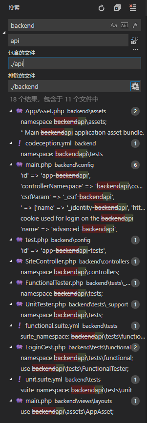
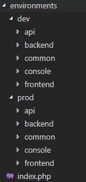

经过这个方法添加的应用，在初始化的时候，会得到与默认的`backend`和`frontend`一样完整的初始化文件。

步骤完整步骤如下：
<!--more-->

 - 复制应用`backend`一份，改名为`api`

 - 在`api`文件夹中，搜索`backend`，并修改为`api`

    
 - 切换到`api`文件夹下，清除无用的前端文件：
     - `api/views`文件夹
     - `api/web/css`文件夹

 - 切换到项目根目录，配置初始化环境
     - `environments/dev`文件夹下，复制一份`backend`文件夹，修改为`api`
     - `environments/prod`文件夹下，复制一份`backend`文件夹，修改为`api`
     - 修改后的文件目录如下图：
       
     - 在`environments/index.php`中，添加需要初始化的`api`文件夹路径：
```php
<?php
/**
 * The manifest of files that are local to specific environment.
 * This file returns a list of environments that the application
 * may be installed under. The returned data must be in the following
 * format:
 *
 * ```php
 * return [
 *     'environment name' => [
 *         'path' => 'directory storing the local files',
 *         'skipFiles'  => [
 *             // list of files that should only copied once and skipped if they already exist
 *         ],
 *         'setWritable' => [
 *             // list of directories that should be set writable
 *         ],
 *         'setExecutable' => [
 *             // list of files that should be set executable
 *         ],
 *         'setCookieValidationKey' => [
 *             // list of config files that need to be inserted with automatically generated cookie validation keys
 *         ],
 *         'createSymlink' => [
 *             // list of symlinks to be created. Keys are symlinks, and values are the targets.
 *         ],
 *     ],
 * ];
 * ``\`
 */
    return [
        'Development' => [
            'path' => 'dev',
            'setWritable' => [
                'api/runtime',
                'api/web/assets',
                'backend/runtime',
                'backend/web/assets',
                'frontend/runtime',
                'frontend/web/assets',
            ],
            'setExecutable' => [
                'yii',
                'yii_test',
            ],
            'setCookieValidationKey' => [ 
                'api/config/main-local.php',
                'backend/config/main-local.php',
                'common/config/codeception-local.php',
                'frontend/config/main-local.php',
            ],
        ],
        'Production' => [
            'path' => 'prod',
            'setWritable' => [
                'api/runtime',
                'api/web/assets',
                'backend/runtime',
                'backend/web/assets',
                'frontend/runtime',
                'frontend/web/assets',
            ],
            'setExecutable' => [
                'yii',
            ],
            'setCookieValidationKey' => [
                'api/config/main-local.php',
                'backend/config/main-local.php',
                'frontend/config/main-local.php',
            ],
        ],
    ];
```
【题外】由文件顶端的注释可以看出，Yii2框架是支持自定义环境配置的。

 - 在`codeception.yml`(作用于自动测试)中添加初始化配置:
```yaml
    # global codeception file to run tests from all apps
    include:
        - common
        - api
        - frontend
        - backend
    paths:
        log: console/runtime/logs
    settings:
        colors: true
```
 - init初始化框架,见[Yii2框架中初始化脚本init代码解读](https://chelys-cheng.github.io/2018/09/04/Yii2框架中初始化脚本init代码解读/)

